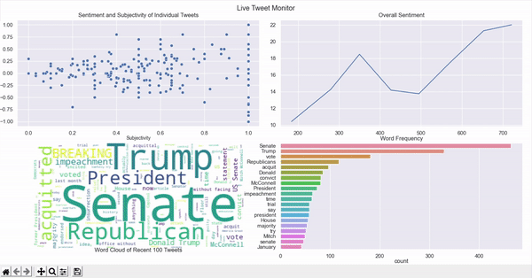

# Twitter Live Monitor

## Overview
Twitter Live Monitor shows you live streaming tweet data with various visualization like word cloud, sentiment analysis and word frequency

## Tools & Technologies
- Python
- Python Libraries
    - Tweepy   
	- Pandas
	- TextBlob
	- Spacy
	- Wordcloud
	- Matplotlib

## Get Started
1. Install required python libraries described above
2. Create a Twitter API Account [here](https://developer.twitter.com/en/docs/twitter-api) 
3. Save Twitter API credentials in a config file and keep it somewhere safe.  
4. Specify the location of the config file in the `filepath` variable in `twitter_stream_data_gen.py` 
5. On the last line of `twitter_stream_data_gen.py`, specify the keyword you want to keep track on. (e.g. stream.filter(track=['**your_keyword**']))
6. Run `twitter_stream_data_gen.py` then a csv file named `stream_data.csv` will be created.
7. While `twitter_stream_data_gen.py` is running, run `twitter_real_time_data_visualization.py` and this will open a window with data visualization.